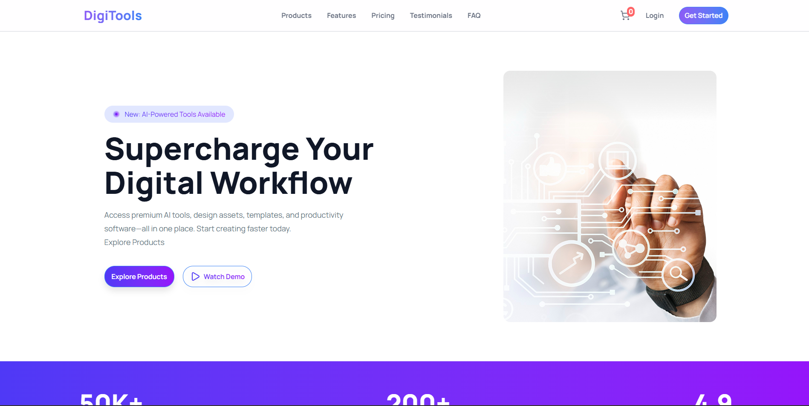

# 🚀 DigiTools - Premium Digital Marketplace

[](https://reactjs.org/)
[](https://tailwindcss.com/)
[](https://vitejs.dev/)

**DigiTools** is a high-performance digital product marketplace. It provides a seamless user experience for browsing and managing premium software assets with real-time state synchronization.

---

## ✨ Key Features

* **⚡ Real-time Cart Sync:** Item counts update instantly across the Navbar and Toggle buttons using React State Lifting.
* **🎨 Premium UI/UX:** Designed with a cinematic aesthetic, featuring Glassmorphism, DaisyUI components, and Tailwind CSS animations.
* **🛡️ Smart Logic:** Integrated duplicate detection (prevents adding the same item twice) and instant feedback via `React-Toastify`.
* **📱 Fully Responsive:** Optimized for all screen sizes from mobile to ultra-wide desktops.
* **📊 Dynamic Content:** All products are fetched from a local JSON structure, simulating a real-world API environment.

---

## 🛠️ Tech Stack

| Category | Technology |
| :--- | :--- |
| **Frontend** | React.js (Vite) |
| **Styling** | Tailwind CSS, DaisyUI |
| **Icons** | Lucide React |
| **Notifications** | React-Toastify |
| **State Management** | React Hooks (useState, useEffect) |

---

## 📂 Project Structure

```text
src/
├── assets/              # Images, Logos, and static assets
├── component/
│   ├── Banner/          # Hero/Welcome section
│   ├── Cards/           # Product card logic and UI
│   ├── Cart/            # Shopping cart view and empty state logic
│   ├── CTA/             # Call to Action section
│   ├── Footer/          # Site footer
│   ├── Info/            # Feature information section
│   ├── Navbar/          # Navigation with live cart counter
│   ├── PremiumTools/    # Core logic container (State & Fetching)
│   ├── Pricing/         # Product pricing tiers
│   ├── ThreeSteps/      # "How it works" guide
│   └── ToggleBtn/       # Switcher between Products and Cart views
├── App.jsx              # Main Entry point (Global State)
├── main.jsx             # React DOM rendering
└── index.css            # Tailwind & Global styles
public/
└── Tools.json           # Local Database (Product Objects)
```

---
## 📸 Preview




---

## 👨‍💻 Author

**Fahim (corebyte56)**
* **GitHub:** [@corebyte56](https://github.com/corebyte56)
* **Role:** Frontend Web Developer

---


## 📝 License

Distributed under the MIT License. See `LICENSE` for more information.
